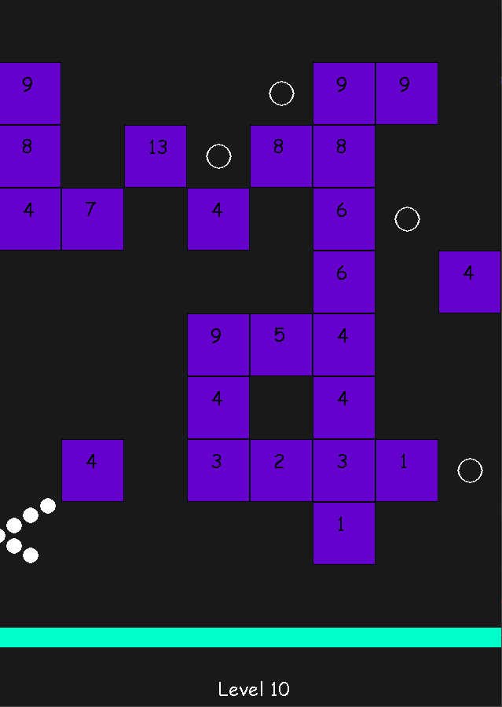

# 99 Balls
An algorithm to beat the game 99 Balls using Actor Critic.

# Making the Game
Before I could teach a computer to beat 99 balls, I first had to recreate it on my desktop in Python.

This was mainly just brushing up on my python skills and working on animation and game design.

Decided how collisions would work was the most difficult part, but I decided on using the last position and current position to analyze the direction the ball was coming from in order to bounce it off the blocks correctly.
For example, if the x and previous x coordinates were both inside a block but the previous y coordinate wasn't, the ball would be hitting the bottom of the block.
This didn't account for hitting corners, where both previous coordinates would be outside of the block, so I implemented a test that would change the direction of any ball that hit a corner to travel directly away from that corner.

# Training the Model

# Learning Points

# Key Issues
