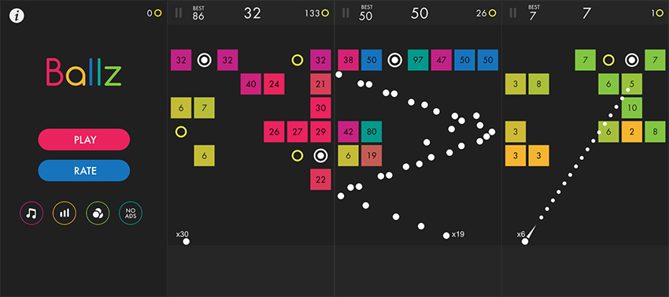

# 99 Balls
An algorithm to beat the game 99 Balls using Actor Critic.

# Making the Game
Before I could teach a computer to beat 99 balls, I first had to recreate it on my desktop in Python.

This was mainly just brushing up on my python skills and working on animation and game design.

Decided how collisions would work was the most difficult part, but I decided on using the last position and current position to analyze the direction the ball was coming from in order to bounce it off the blocks correctly.
For example, if the x and previous x coordinates were both inside a block but the previous y coordinate wasn't, the ball would be hitting the bottom of the block.

This didn't account for hitting corners, where both previous coordinates would be outside of the block, so I implemented a test that would change the direction of any ball that hit a corner to travel directly away from that corner.

# Training the Model
Now that I had my game, it was time to try and beat it. 

Initially the model pretty much plays randomly according to its epsilon greedy policy.

## Model
The model is made up of two parts, an actor and a critic.

The actor takes in the state, and passes that through three hidden layers of a neural network to output the optimal action to take.

The critic takes in both the state and the action, the state goes through two hidden layers before being concatenated with the action that goes through one hidden layers, after they are joined they go through one hidden layer before the neural network outputs the reward that should be given to that state-action pair.
## State

The state is simply a flattened 8x8x3 representation of the coordinates of each block and orb on the screen, with the x-coordinate of the firing point and number of balls appended to the end.
## Weight Updates

Training the models required the use of gradient descent to minimize the loss of the critic network and gradient ascent to maximize the reward gained by the actor.

Every single step, the model would take an action pulled from the actor model and determine the state and reward that the action caused. This information is then used to determine how far off the estimated reward was from the actual reward received.

The actor is trained by taking a gradient ascent step in whatever direction maximizes the reward received from the critic.

The critic is trained by taking a gradient descent step in whatever direction minimizes the loss between the actual reward received and the output of the critic.
## Training

Initially I trained the model to take any number that was smaller than .1 radians from horizontal and change it into .1 radians, so the initial model quickly learned to decay all of the actions to be closer and closer to zero because always shooting close to horizontal is an optimal solution to this game.

The model starts to output smaller values

The model begins to win games

The model consistently reaches level 100 more often than it does not

## Trying again

I then tried to limit this problem by expanding how low the balls could be fired as well as not firing at all if the output was too small.

Unfortunately, this wasn't able to defeat the game, but it was able to improve a decent amount.

Here is the trained version, it clearly has learnt a policy that regularly gets into the 40s, but it isn't an optimal one.

# Learning Points

# Key Issues
