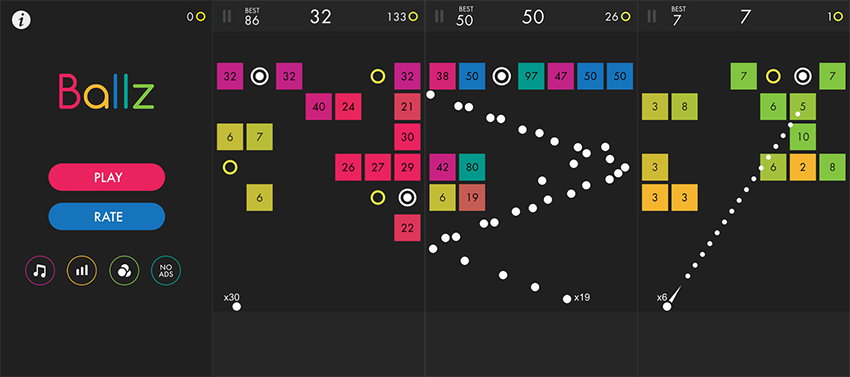

# 99 Balls
An algorithm to beat the game 99 Balls using Actor Critic.

# Making the Game
Before I could teach a computer to beat 99 balls, I first had to recreate it on my desktop in Python.

# Training the Model

# Learning Points

# Key Issues
